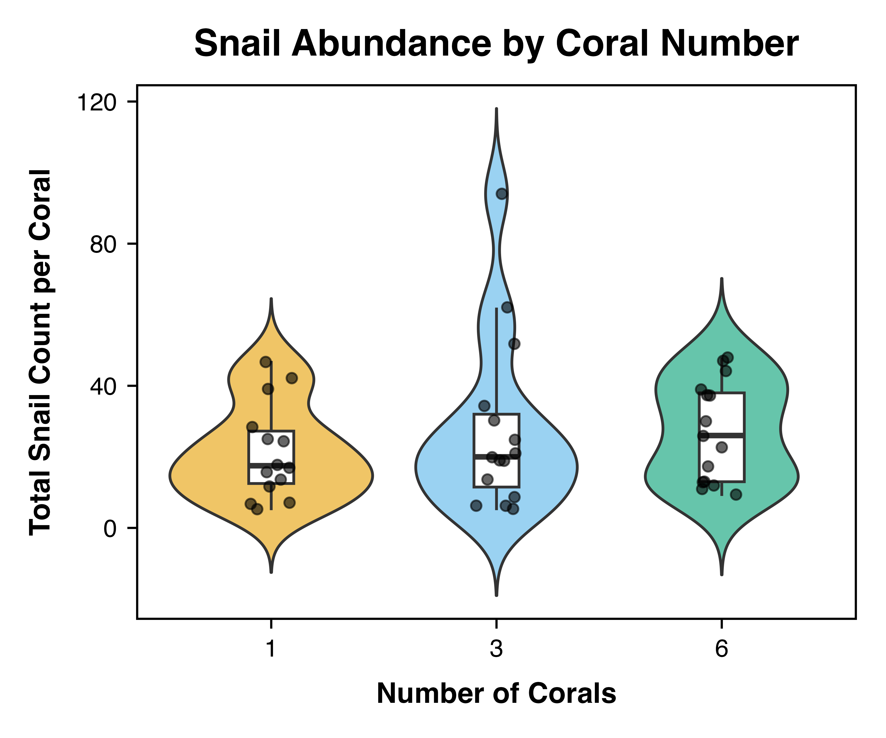
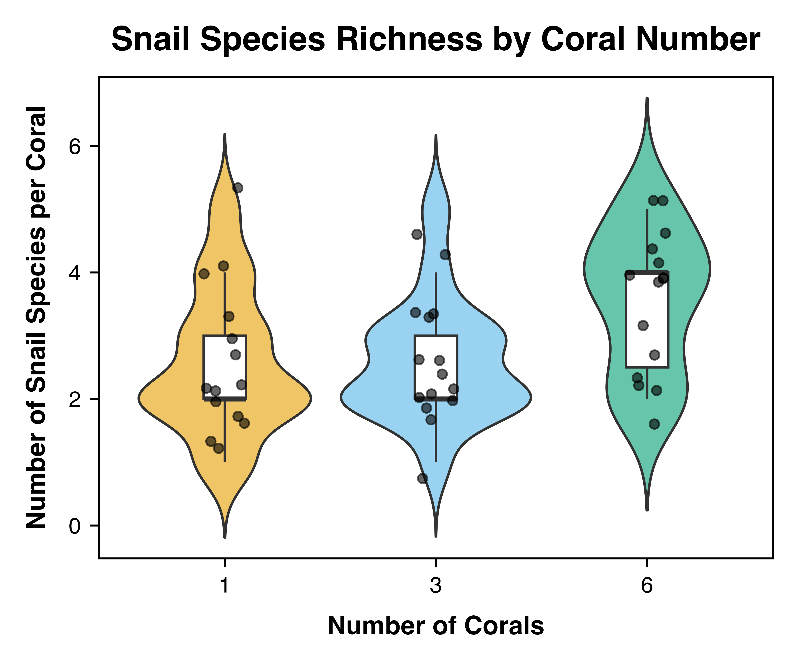
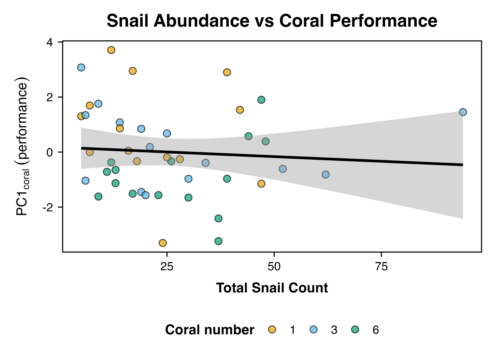
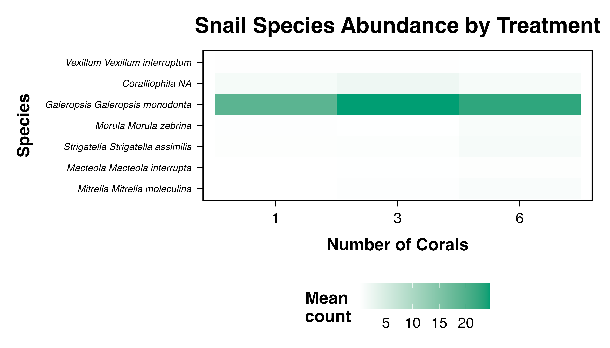

# Corallivorous Snail Analysis

**Author:** MRB CAFI Analysis
**Date:** November 20, 2025
**Purpose:** Address reviewer comment on snail patterns

---

## Executive Summary

> **Reviewer Comment (Joe):** "Seems odd not to mention the snails, especially given their propensity to eat coral and that of the three broad groups they showed the strongest and most consistent hyperaggregation on 6-coral reefs"

### Bottom Line

**Snails did NOT show hyperaggregation and are unlikely to drive coral decline:**

| Finding | Result | Interpretation |
|---------|--------|----------------|
| Total abundance | F = 0.43, p = 0.660 | No treatment effect |
| Species richness | F = 3.73, **p = 0.032** | Higher on 6-coral reefs |
| Hyperaggregation | 1.26× increase | Well below 6× expected |
| Performance correlation | r = -0.08, p = 0.625 | No relationship |

---

## Background

This analysis examines whether corallivorous gastropods (snails) could explain the observed density-dependent decline in coral performance. We tested three hypotheses:

1. Snails hyperaggregate on multi-coral reefs
2. Snail distributions are clustered on 6-coral reefs
3. Snail abundance negatively correlates with coral performance

---

## Methods

### Species Identification

We identified 13 gastropod species from coral-associated genera known to include corallivores:

| Genus | Species | Notes |
|-------|---------|-------|
| *Drupella* | *margariticola* | Known corallivore |
| *Coralliophila* | sp. | Known corallivore |
| *Galeropsis* | *monodonta* | Coral-associated |
| *Morula* | *zebrina*, *uva* | Predatory |
| *Strigatella* | *assimilis* | Coral-associated |
| *Vexillum* | *interruptum*, *roseum*, *tusum*, *aureolatum* | Coral habitat |
| *Macteola* | *interrupta* | Coral-associated |
| *Mitrella* | *moleculina* | Coral-associated |

### Statistical Approach

- **Treatment effects:** Linear mixed models with reef as random effect
- **Hyperaggregation:** Comparison to 6× expected under proportional scaling
- **Performance relationship:** Pearson correlation with PC1<sub>coral</sub>

---

## Results

### 1. Snail Abundance by Treatment



#### Summary Statistics

| Treatment | n | Mean ± SE |
|-----------|---|-----------|
| 1 coral | 14 | 21.5 ± 3.6 |
| 3 corals | 15 | 27.7 ± 6.4 |
| 6 corals | 15 | 27.1 ± 3.7 |

#### Statistical Test

```
Model: total_snails ~ treatment + (1|reef)

F₂,₃₉ = 0.43, p = 0.660
```

**Result:** No significant treatment effect on total snail abundance.

---

### 2. Snail Species Richness



#### Summary Statistics

| Treatment | Mean Richness ± SE |
|-----------|--------------------|
| 1 coral | 2.57 ± 0.31 |
| 3 corals | 2.60 ± 0.25 |
| 6 corals | 3.53 ± 0.29 |

#### Statistical Test

```
Model: snail_richness ~ treatment + (1|reef)

F₂,₃₉ = 3.73, p = 0.032 *
```

**Result:** Significant treatment effect. Six-coral reefs supported 37% more snail species than 1-coral reefs.

---

### 3. Test for Hyperaggregation

**Definition:** Hyperaggregation occurs when abundance increases more than proportionally with habitat (coral number).

| Metric | Expected | Observed |
|--------|----------|----------|
| Fold increase (1→6 corals) | 6.0× | 1.26× |

**Result:** Snails showed **hypoaggregation** (less than proportional increase), not hyperaggregation.

---

### 4. Relationship with Coral Performance



#### Correlation Analysis

```
Pearson correlation: r = -0.076
p-value = 0.625
n = 44
```

**Result:** No significant relationship between snail abundance and coral performance (PC1<sub>coral</sub>).

---

### 5. Species-Level Patterns



#### Individual Species Tests

| Species | Treatment Effect | Performance Correlation |
|---------|-----------------|------------------------|
| *Morula zebrina* | F = 3.77, **p = 0.031** | r = -0.04, p = 0.82 |
| *Strigatella assimilis* | F = 2.29, p = 0.13 | r = -0.05, p = 0.76 |
| *Mitrella moleculina* | F = 2.01, p = 0.16 | r = -0.24, p = 0.11 |
| *Macteola interrupta* | F = 1.08, p = 0.36 | r = -0.16, p = 0.29 |
| *Coralliophila* sp. | F = 0.76, p = 0.49 | r = 0.03, p = 0.83 |
| *Galeropsis monodonta* | F = 0.37, p = 0.69 | r = -0.06, p = 0.68 |
| *Vexillum interruptum* | F = 0.10, p = 0.91 | r = 0.09, p = 0.58 |

**Result:** Only *Morula zebrina* showed a significant treatment effect. No species showed significant correlations with coral performance.

---

## Summary

### Key Findings

| Question | Answer | Evidence |
|----------|--------|----------|
| Did snail abundance increase with coral number? | **No** | F = 0.43, p = 0.66 |
| Did snail richness increase? | **Yes** | F = 3.73, p = 0.032 |
| Did snails hyperaggregate? | **No** | 1.26× vs 6× expected |
| Are snails correlated with coral decline? | **No** | r = -0.08, p = 0.63 |

### Biological Interpretation

1. **Species richness increases but not abundance**
   Multi-coral reefs support more snail species but not higher densities, suggesting habitat diversity rather than resource concentration.

2. **No evidence for snail-mediated coral decline**
   The non-significant correlation between snail abundance and PC1<sub>coral</sub> does not support gastropods as drivers of density-dependent performance decline.

3. **Individual species effects are weak**
   Only 1 of 7 species (*Morula zebrina*) showed significant treatment effects, and no species correlated with coral performance.

---

## Conclusions

### Response to Reviewer

**Contrary to the expectation that snails showed "the strongest and most consistent hyperaggregation on 6-coral reefs," our analysis reveals:**

1. ❌ **No hyperaggregation** in total snail abundance (1.26× vs 6× expected)
2. ❌ **No treatment effect** on total abundance (p = 0.66)
3. ✓ **Higher species richness** on 6-coral reefs (p = 0.032)
4. ❌ **No correlation** with coral performance (p = 0.63)

### Implications

**Snails are unlikely to be the primary driver of density-dependent coral decline.** While 6-coral reefs support more snail species, this diversity pattern is not associated with coral performance and likely reflects habitat heterogeneity rather than corallivore aggregation.

This finding strengthens the conclusion that shifts in beneficial CAFI species (e.g., *Dascyllus*, shrimp) rather than harmful gastropods drive the observed performance patterns.

---

## Methods Summary

**Data:** 44 corals (≥80% alive), 13 snail species
**Models:** LMM with reef random effect
**Software:** R 4.x with lme4, lmerTest, emmeans
**Analysis script:** `scripts/MRB/snail_corallivore_analysis.R`

---

*Analysis completed: November 20, 2025*
